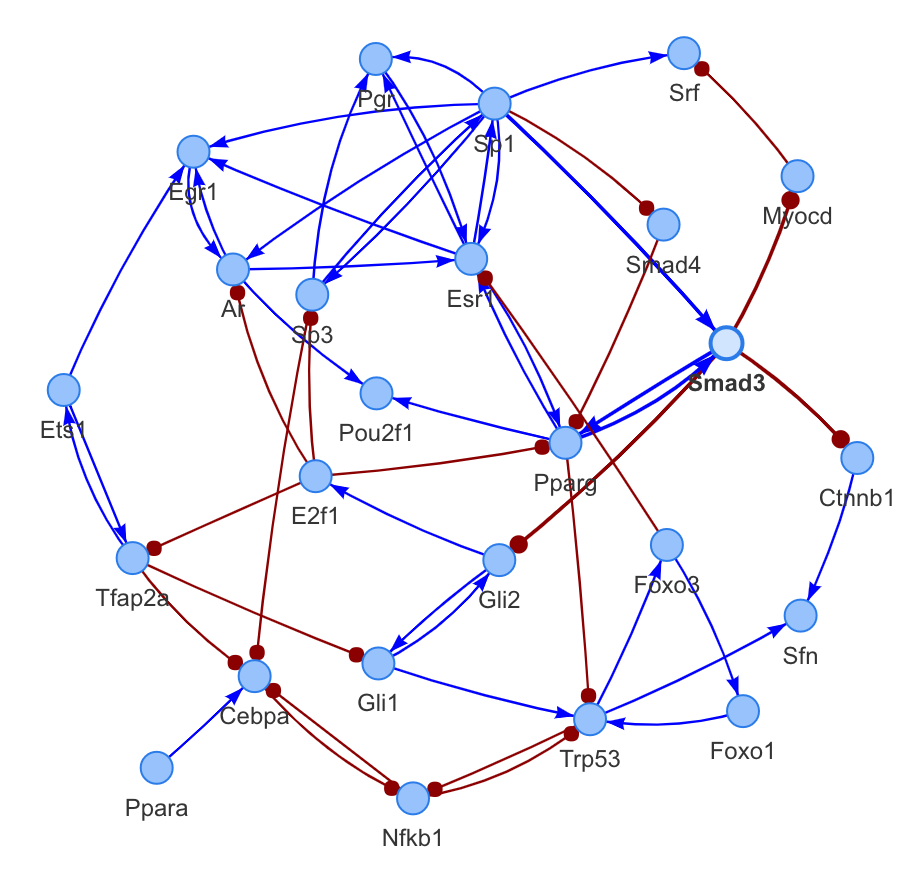

```{r setup, include=FALSE}
require(knitr)
knitr::opts_chunk$set(echo = TRUE, warning = FALSE, message = FALSE, fig.width = 7, fig.height = 6, fig.align = "center")
```

# Introduction

NetAct is a computational platform that uses both transcriptomic data and literature-based transcription factor-target databases to construct core transcription-factor regulatory networks. This tutorial aims to demonstrate the core functional components of NetAct and how one uses it to construct and model a transcription-factor regulatory network. The experimental RNA-seq data utilized in this workflow is from Sheridan et al. (2015) and consists of three cell populations (basal, luminal progenitor (LP) and mature luminal (ML)) sorted from the mammary glands of female virgin mice. Using the GEO Series accession number [GSE63310](https://www.ncbi.nlm.nih.gov/geo/query/acc.cgi?acc=GSE63310), count data for these samples can be downloaded from the Gene Expression Omnibus (GEO) http://www.ncbi.nlm.nih.gov/geo/. 

# Load libraries and data

The analysis begins by downloading text files that contain raw gene-level counts for each sample. The file GSE63310_RAW.tar is available online at http://www.ncbi.nlm.nih.gov/geo/download/?acc=GSE63310&format=file. 

```{r }
library(NetAct)

url <- "https://www.ncbi.nlm.nih.gov/geo/download/?acc=GSE63310&format=file"
utils::download.file(url, destfile="GSE63310_RAW.tar", mode="wb") 
utils::untar("GSE63310_RAW.tar", exdir = ".")
files <- c("GSM1545535_10_6_5_11.txt", "GSM1545536_9_6_5_11.txt", "GSM1545538_purep53.txt",
           "GSM1545539_JMS8-2.txt", "GSM1545540_JMS8-3.txt", "GSM1545541_JMS8-4.txt",
           "GSM1545542_JMS8-5.txt", "GSM1545544_JMS9-P7c.txt", "GSM1545545_JMS9-P8c.txt")
for(i in paste(files, ".gz", sep="")){
  R.utils::gunzip(i, overwrite=TRUE)
}

files <- c("GSM1545535_10_6_5_11.txt", "GSM1545536_9_6_5_11.txt", 
           "GSM1545538_purep53.txt", "GSM1545539_JMS8-2.txt", 
           "GSM1545540_JMS8-3.txt", "GSM1545541_JMS8-4.txt", 
           "GSM1545542_JMS8-5.txt", "GSM1545544_JMS9-P7c.txt", 
           "GSM1545545_JMS9-P8c.txt")

x <- edgeR::readDGE(files, columns=c(1,3))
group <- as.factor(c("LP", "ML", "Basal", "Basal", "ML", "LP", "Basal", "ML", "LP"))
x$samples$group <- group
samplenames <- c("LP1", "ML1", "Basal1", "Basal2", "ML2", "LP2", "Basal3", "ML3", "LP3")
colnames(x) <- samplenames
```

# Set up comparisons and phenodata

Before proceeding, it is important to define all the group comparisons you are interested in as well as an R dataframe that contains all the relevant phenotype metadata including the group names. 

```{r }
compList <- c("Basal-LP", "Basal-ML", "LP-ML")
phenoData = new("AnnotatedDataFrame", data = data.frame(celltype = group))
rownames(phenoData) = colnames(x$counts)
```

# Preprocess and DEG analysis

Fro RNA-seq data, NetAct provides a useful pre-processing function called ```preprocess_counts()``` that filters out lowly expressed genes and retrieves associated gene symbols for raw count data. Differentially expressed genes (DEGs) are then identified using the limma package. The resultant normalized expression data is saved alongside the *phenoData* metadata into the standard ```ExpressionSet``` object for downstream analysis. 

```{r}
counts <- Preprocess_counts(counts = x$counts, groups = group, mouse = TRUE)
DErslt = RNAseqDegs_limma(counts = counts, phenodata = phenoData, 
                          complist = compList, qval = 0.05)

neweset = Biobase::ExpressionSet(assayData = as.matrix(DErslt$Overall$e), phenoData = phenoData)
```

Alternatively, the users can choose to use DESeq2 for the DEG analysis.

```{r}
DErslt2 = RNAseqDegs_DESeq(counts = counts, phenodata = phenoData, 
                          complist = compList, qval = 0.05)
neweset2 = Biobase::ExpressionSet(assayData = as.matrix(DErslt2$Overall$e), phenoData = phenoData)
```

# Identify significantly enriched TFs

We adopt a permutation approach to select the significantly enriched TFs by using the GSEA algorithm. The TFs are aggregated from the multiple comparisons by considering the q-value cutoff. This step usually takes the longest and thus we recommend saving the output by providing a file name. The results from this step in the tutorial can be retried from the  *vignettes* folder on our GitHub.

```{r }
data("mDB")
calc <- FALSE

if (calc) {
  gsearslts <- TF_Selection(GSDB = mDB, DErslt = DErslt, minSize = 5, nperm = 10000,
                            qval = 0.05, compList = compList,
                            nameFile = "gsearslts_tutorial")
} else {
  gsearslts <- readRDS(file = "gsearslts_tutorial.RDS")
}

tfs <- gsearslts$tfs
tfs
```

In the cases where comparison specific TFs are needed or when comparisons require varying q-value cutoffs, the ```Reselect_TFs()``` function comes in handy. The argument *qval* can be a vector of q-value cutoffs for different comparisons.

```{r }
Reselect_TFs(GSEArslt = gsearslts$GSEArslt, qval = 0.01)
```

# Calculate the activities of the selected TFs

NetAct infers the activities of the selected regulators based on the expression of their targets. The results show clearer TF activity patterns than those from heir gene expression.

```{r }
act.me <- TF_Activity(tfs, mDB, neweset, DErslt$Overall)
acts_mat = act.me$all_activities
Activity_heatmap(acts_mat, neweset)
```

# Construct gene regualtory network

In this step we output the gene regulatory network topology by filtering the link relations based on mutual information and entropy. The ```plot_network()``` function provides an interactive view of the network topology. The image of the network "tutorial_network.png" is provided in the *vignettes* folder. 

```{r }
tf_links = TF_Filter(acts_mat, mDB, miTh = .05, nbins = 8, corMethod = "spearman", DPI = T)
plot_network(tf_links)
```
<center> {width=60%} </center>

# RACIPE simulations

We then use the algorithm RACIPE to model the dynamical behavior of the network we constructed. It is recommended to simulate 10,000 models.  

```{r }
racipe_results <- sRACIPE::sracipeSimulate(circuit = tf_links, numModels = 200, plots = TRUE)
```

# References

Su K, et al (2022) NetAct: a computational platform to construct core transcription factor regulatory networks using gene activity, Genome Biology, 23:270. https://doi.org/10.1186/s13059-022-02835-3

# Session Information

```{r}
sessionInfo()
```